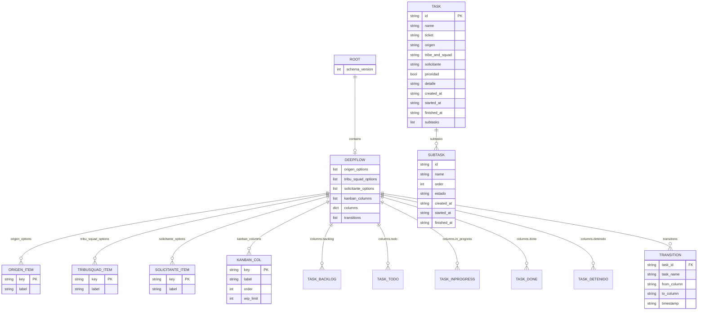

# Diagrama de la base de datos – DeepFlow

**DeepFlow** = Administrador de tareas para tracking y alertas sobre trabajo asignado.

Documento de mantenimiento: estructura de ZODB (`data/db/deepflow_db.fs`).

### Resumen del diseño

| Capa          | Contenido                                                                 |
|:--------------|:---------------------------------------------------------------------------|
| **Maestros**  | Origen, Tribu.Squad, Solicitante, **Kanban** (columnas)                   |
| **Task**      | id, nombre, fechas, origen, prioridad, detalle, subtasks (estado = ubicación en columns) |
| **Subtask**   | estado, nombre, fechas (creación, inicio, fin)                            |
| **Transitions** | Registro de cambios de estado de Task                                   |

---

## 1. Vista general (ER conceptual)

```
┌──────────────────────────────────────────────────────────────────────────┐
│  ZODB root                                                               │
├──────────────────────────────────────────────────────────────────────────┤
│  schema_version: int                                                      │
│                                                                          │
│  deepflow: {  ◀── CONTAINER                                               │
│  │                                                                       │
│  ├── origen_options       list[{key, label}]                              │
│  ├── tribu_squad_options  list[{key, label}]                             │
│  ├── solicitante_options  list[{key, label}]                              │
│  ├── kanban_columns       list[{key, label, order, wip_limit}]            │
│  ├── columns              dict[key → list[Task]]                          │
│  └── transitions          list[Transition]                                │
│  }                                                                       │
└──────────────────────────────────────────────────────────────────────────┘
```

### Container vs Entidad (para venir de SQL)

| Concepto     | En DeepFlow                     | Equivalente SQL       |
|--------------|---------------------------------|------------------------|
| **Container**| `root["deepflow"]` – datos del tablero + maestros | Base de datos / esquema |
| **Entidad**  | **Task** – cada tarea individual | Fila de tabla          |
| **Maestros** | Listas de opciones para combos  | Tablas lookup / catálogos |
| **Estado**  | Por ubicación: en qué lista de `columns` está el Task | No hay campo estado; el contenedor define el estado |

---

## 2. Estructura detallada

### 2.1 Root

| Campo            | Tipo | Descripción                                      |
|------------------|------|--------------------------------------------------|
| `schema_version` | int  | Versión del schema; para migraciones             |
| `deepflow`       | dict | **Container** – maestros + columnas + transiciones |

### 2.2 DeepFlow (container)

#### Maestros (catálogos para combos)

Resumen:

| Maestro             | Tipo            | Descripción                              |
|:--------------------|:----------------|:-----------------------------------------|
| `origen_options`    | list[OrigenItem]| Medio por donde se reportó la tarea      |
| `tribu_squad_options`| list[TribuItem]| Tribu y squad asignados                  |
| `solicitante_options`| list[SolicitanteItem]| Persona que solicitó (key = correo) |
| `kanban_columns`    | list[KanbanCol] | Columnas del tablero Kanban              |

---

##### Maestro Origen (`origen_options`)

Define los medios por los que puede reportarse una tarea. Cada ítem:

| Campo   | Tipo | Req | Descripción                              |
|:--------|:-----|:---:|:-----------------------------------------|
| `key`   | str  | ✅  | ID interno (para FK en Task)              |
| `label` | str  | ✅  | Etiqueta visible en combo                |

Valores por defecto:
```
[
  {key: "teams",   label: "Teams"},
  {key: "correo",  label: "Correo"}
]
```

*Unicidad:* La aplicación valida que `key` sea único en cada maestro antes de insertar/actualizar.

---

##### Maestro Tribu.Squad (`tribu_squad_options`)

Define las tribus y squads disponibles. Cada ítem:

| Campo   | Tipo | Req | Descripción                              |
|:--------|:-----|:---:|:-----------------------------------------|
| `key`   | str  | ✅  | ID interno (para FK en Task)              |
| `label` | str  | ✅  | Etiqueta visible en combo                |

Valores por defecto:
```
[
  {key: "tribu_supply",  label: "Tribu Supply"},
  {key: "tribu_lealtad", label: "Tribu Lealtad"}
]
```

*Unicidad:* La aplicación valida que `key` sea único en cada maestro antes de insertar/actualizar.

---

##### Maestro Solicitante (`solicitante_options`)

Define las personas que pueden solicitar tareas. Lista dinámica que crece con el uso. Cada ítem:

| Campo   | Tipo | Req | Descripción                              |
|:--------|:-----|:---:|:-----------------------------------------|
| `key`   | str  | ✅  | Correo electrónico (identificador único) |
| `label` | str  | ✅  | Nombre visible en combo                  |

Valores por defecto:
```
[]
```

Ejemplo: `{key: "juan@empresa.com", label: "Juan Pérez"}`

*Nota:* Se va poblando al crear/editar tareas. Permite texto libre si no está en el maestro.

*Unicidad:* La aplicación valida que `key` sea único en cada maestro antes de insertar/actualizar.

---

##### Maestro Kanban (`kanban_columns`)

Define las columnas del tablero. Cada ítem:

| Campo       | Tipo | Req | Descripción                              |
|:------------|:-----|:---:|:-----------------------------------------|
| `key`       | str  | ✅  | ID interno (backlog, todo, in_progress…) |
| `label`     | str  | ✅  | Etiqueta visible ("Backlog", "To Do")    |
| `order`     | int  | ✅  | Orden de visualización (1, 2, 3…)       |
| `wip_limit` | int  |     | Límite WIP (ej: 3)                       |

Valores por defecto:
```
[
  {key: "backlog",     label: "Backlog",     order: 1, wip_limit: null},  # Sin límite: captura sin fricción
  {key: "todo",        label: "To Do",        order: 2, wip_limit: 3},
  {key: "in_progress", label: "In Progress",  order: 3, wip_limit: 3},
  {key: "done",        label: "Done",         order: 4, wip_limit: null},  # Sin límite: finalizadas
  {key: "detenido",    label: "Detenido",     order: 5, wip_limit: 5}
]
```

`wip_limit: null` = sin límite. Editable en Maestros → Columnas Kanban.

*Unicidad:* La aplicación valida que `key` sea único en cada maestro antes de insertar/actualizar.

---

#### Datos del tablero

| Campo         | Tipo           | Descripción                                              |
|:--------------|:---------------|:---------------------------------------------------------|
| `columns`     | dict[str→Task] | Claves = `key` del maestro Kanban; valor = list[Task]    |
| `transitions` | list[Transition]| Historial de cambios de estado                           |

**Enfoque: estado por ubicación, no por campo.**  
El Task no tiene campo `estado`. Se almacena en listas distintas: `columns.backlog`, `columns.todo`, `columns.in_progress`, etc. El estado se deduce de **en qué lista está** la tarea; mover una tarea = sacarla de una lista y ponerla en otra. Cada columna Kanban es un contenedor físico distinto.

**Invariante:** Las claves de `columns` deben existir en `kanban_columns[].key`.

### 2.3 Task (entidad)

La **entidad Task** es cada tarea individual. Todos los datos de la tarea.

#### Identificación

| Campo   | Tipo       | Req | Descripción                    |
|:--------|:-----------|:---:|:-------------------------------|
| `id`    | str (UUID) | ✅  | PK – Identificador único       |
| `name`  | str        | ✅  | Nombre de la tarea             |
| `ticket`| str        |     | Código externo (Jira, INC-456)|

#### Prioridad

| Campo      | Tipo | Req | Descripción                                        |
|:-----------|:-----|:---:|:---------------------------------------------------|
| `prioridad`| bool |     | Flag de prioridad (true = alta). Escalable a maestro si se necesita (baja/media/alta/crítica) |

*Estado:* El Task **no tiene** campo `estado`. Su posición (en qué lista de `columns` está) define el estado. No se guarda en el Task; se almacena en lugares distintos.

#### Referencias a maestros (valores de combo)

| Campo             | Tipo | Req | Descripción                              |
|:------------------|:-----|:---:|:-----------------------------------------|
| `origen`          | str  |     | FK maestro → `origen_options[].key` (ej: "teams", "correo") |
| `tribe_and_squad` | str  |     | FK maestro → `tribu_squad_options[].key` (ej: "tribu_supply") |
| `solicitante`     | str  |     | FK maestro → correo (`solicitante_options[].key`) o texto libre |

#### Fechas

| Campo        | Tipo       | Req | Descripción                    |
|:-------------|:-----------|:---:|:-------------------------------|
| `created_at` | str (ISO)  | ✅  | Fecha de solicitud (creación al registrar) |
| `entered_at` | str (ISO)  |     | Entrada en columna actual (interno) |
| `started_at` | str (ISO)  |     | Fecha de inicio (calculada: primera vez en In Progress) |
| `finished_at`| str (ISO)  |     | Fecha de fin (calculada: cuando llega a Done) |
| `due_date`   | str (ISO)  |     | Fecha de compromiso (vacía por defecto) |

*Formato fechas:* ISO 8601 con timezone, ej: `2025-03-12T10:30:00+00:00`. Permite ordenación y reportes multi-zona.

#### Detalle

| Campo    | Tipo | Req | Descripción                    |
|:---------|:-----|:---:|:-------------------------------|
| `detalle`| str  |     | Descripción detallada de la tarea |

#### Valores por defecto (Task)

| Campo         | Default   |
|:--------------|:----------|
| `ticket`     | `""`      |
| `prioridad`  | `false`   |
| `origen`     | `""`      |
| `tribe_and_squad` | `""` |
| `solicitante`| `""`      |
| `detalle`    | `""`      |
| `started_at` | `null`    |
| `finished_at`| `null`    |
| `due_date`   | `""`      |
| `subtasks`   | `[]`      |

#### Hijos (embebidos)

| Campo      | Tipo          | Descripción                    |
|:-----------|:--------------|:-------------------------------|
| `subtasks` | list[Subtask] | Subtareas con estado y fechas  |

#### ¿Existe FK en NoSQL?

| Caso                        | ¿FK? | Explicación                                                                 |
|:----------------------------|:----:|:-----------------------------------------------------------------------------|
| `Task.id`                  | PK   | Clave primaria. `Transition.task_id` lo referencia.                         |
| `Task.origen`               | ✅   | Valor del maestro `origen_options`                                          |
| `Task.tribe_and_squad`      | ✅   | Valor del maestro `tribu_squad_options`                                      |
| `Task.solicitante`          | ✅   | Valor del maestro o texto libre                                              |
| `Task.subtasks`             | ❌   | **Embebido** – viven dentro del Task                                         |
| Columna (estado)            | ❌   | **Por ubicación** – el Task no tiene campo estado; en qué lista está lo define |

---

### 2.4 Subtask (entidad embebida)

Cada subtarea con su propio ciclo de vida (estado y fechas).

| Campo       | Tipo       | Req | Descripción                    |
|:------------|:-----------|:---:|:-------------------------------|
| `id`        | str (UUID) |     | Identificador (opcional)       |
| `name`      | str        | ✅  | Nombre de la subtarea          |
| `order`     | int        |     | Orden de visualización (0, 1, 2…) |
| `estado`    | str        |     | Valores fijos: "pending" \| "in_progress" \| "done" (default: "pending") |
| `created_at`| str (ISO)  |     | Fecha de creación              |
| `started_at`| str (ISO)  |     | Fecha de inicio                |
| `finished_at`| str (ISO) |     | Fecha de fin                   |

*Estado Subtask:* Valores fijos por diseño. Si se requiere extensibilidad futura, migrar a maestro `subtask_estado_options`.

*Legacy:* Si existe `text` y `done`, se consideran equivalente a `name` y `estado == "done"`.

### 2.5 Transition

Registro de cada cambio de estado de un Task entre columnas.

| Campo         | Tipo        | Descripción                        |
|:--------------|:------------|:-----------------------------------|
| `task_id`     | str         | **FK** → `Task.id` (puede quedar huérfano si Task se elimina) |
| `task_name`   | str         | Nombre en el momento del movimiento|
| `from_column` | str \| null | Columna origen (null si creación)   |
| `to_column`   | str         | Columna destino                    |
| `timestamp`   | str (ISO)   | Momento del movimiento (ISO 8601)  |

---

## 3. Diagrama entidad-relación (Mermaid)



---

## 4. Diagrama de flujo de columnas

Flujo definido por **maestro Kanban** (`kanban_columns`). Por defecto:

```
                    ┌──────────┐
                    │ BACKLOG  │  order: 1
                    └────┬────┘
                         │
                    ┌────▼────┐
                    │  TODO   │  order: 2
                    └────┬────┘
                         │
         ┌────────────────┼────────────────┐
         │                │                │
    ┌────▼────┐     ┌─────▼─────┐     ┌────▼────┐
    │DETENIDO │     │IN_PROGRESS│     │  DONE   │  order: 3, 4, 5
    └─────────┘     └───────────┘     └─────────┘
         │                   │
         └───────────────────┘
              (ida y vuelta)
```

Las columnas son configurables; el maestro define orden, etiqueta y límite WIP.

---

## 5. Terminología NoSQL

| SQL       | ZODB / DeepFlow               |
|-----------|-------------------------------|
| Base/esquema | **Container** `deepflow`  |
| Tabla     | No hay tablas; el container tiene listas |
| Fila      | **Entidad** Task              |
| Columna   | Atributo / Campo del dict     |

- **Container** = `deepflow` – agrupa todos los datos del tablero.
- **Entidad** = **Task** – cada tarea individual.

---

## 6. Reglas y políticas

### 6.1 Integridad referencial

| Caso | Política |
|:-----|:---------|
| **Eliminar ítem de maestro** (Origen, Tribu.Squad, Solicitante) | No permitir si existen Tasks referenciando. Alternativa: migrar Tasks a valor por defecto (`""`) y luego eliminar. |
| **Eliminar columna de Kanban** | No permitir si la columna tiene Tasks. Migrar Tasks a columna por defecto (ej: backlog) antes de eliminar. |
| **Eliminar Task** | **Borrado físico.** Las Transitions con ese `task_id` pasan a ser huérfanas (solo referencia histórica). Se conservan para reportes; filtros por Task ignoran transitions de Tasks eliminados. |
| **Task.solicitante texto libre** | Si el valor no existe en `solicitante_options`, se acepta y opcionalmente se puede ofrecer añadirlo al maestro. |

### 6.2 Soft delete

**Decisión:** Borrado físico. No hay `deleted_at` ni archivo de eliminados. Las Transitions conservan `task_id` para historial; no se eliminan en cascada.

*Futuro:* Si se requiere auditoría de eliminaciones, añadir `deleted_tasks` o `deleted_at` en Task.

### 6.3 Triggers (a nivel de aplicación)

ZODB no tiene triggers de base de datos. La lógica se ejecuta en la **capa de aplicación** (BoardService, etc.) dentro de cada operación:

| Evento      | Ubicación            | Acciones tipo trigger                           |
|:------------|:---------------------|:------------------------------------------------|
| Crear Task  | `create_task`, `create_task_in` | Registrar Transition, validar WIP            |
| Mover Task  | `move_task`          | Actualizar `started_at`/`finished_at`, registrar Transition |
| Eliminar Task | `delete_task`      | (Opcional) Log, notificación                    |
| Actualizar Task | `update_task_*`  | (Opcional) Validar FK a maestros               |

*Patrón:* En el servicio, tras la operación principal y antes de persistir, ejecutar la lógica de “trigger” (transitions, alertas, validaciones).

### 6.4 Alertas

**Decisión:** Las alertas son **lógica de aplicación**, no se persisten en BD.

- Reglas: ej. "alerta si >2 tareas en In Progress hace 5 días", "alerta si columna en overcapacity"
- Configuración: constantes o archivo de config (fuera de ZODB)
- Historial de alertas disparadas: opcional en versión futura (ej. `alert_log`)

### 6.5 Consistencia columns ↔ kanban_columns

- Las claves de `columns` deben ser subconjunto de `kanban_columns[].key`.
- Al añadir columna en maestro: crear `columns[new_key] = []`.
- Al eliminar columna (tras migrar Tasks): eliminar `columns[key]` y el ítem del maestro.

---

## 7. Convenciones técnicas

### 7.1 Formato de fechas

**ISO 8601** con timezone: `YYYY-MM-DDTHH:mm:ss+00:00` (ej: `2025-03-12T10:30:00+00:00`).

- Facilita ordenación y reportes.
- Usar UTC (`+00:00`) para consistencia; la UI puede convertir a zona local.

### 7.2 Límites operativos (orientativos)

| Elemento | Límite sugerido | Motivo |
|:---------|:----------------|:-------|
| Tasks por columna | wip_limit (ej: 3) | Regla de negocio |
| Subtasks por Task | 50 | UX, rendimiento |
| Transitions totales | Sin límite práctico | Crecimiento lineal; ver 7.3 |
| Ítems en maestros | 100–200 c/u | Combos manejables |

### 7.3 Rendimiento

- **Transitions:** Búsqueda por `task_id` es O(n). Para >10k transitions, considerar índice auxiliar `{task_id: [indices]}` o estructura indexada en futuras versiones.
- **Task por id:** Actualmente O(n) recorriendo columnas. Aceptable para cientos de Tasks; para miles, considerar índice `id → Task`.

---

## 8. Ubicación y mantenimiento

| Elemento               | Ubicación                                  |
|------------------------|--------------------------------------------|
| Archivo BD             | `data/db/deepflow_db.fs`                   |
| Repositorio            | `infrastructure/persistence/zodb_repository.py`  |
| Migraciones            | `infrastructure/persistence/schema_versions.py`  |
| Constantes (columnas)  | `domain/taskboard/constants.py`            |

### Versiones de schema

| Versión | Cambio                                          |
|---------|--------------------------------------------------|
| 1       | Columnas + transitions                           |
| 2       | Campo `ticket` en tareas                          |
| 3       | `tribe_and_squad`, `requester`, `reporting_channel` |
| 4       | Maestros (origen, tribu_squad, solicitante), Task, Subtask, transitions |
| 5       | Maestros persistentes (tribu_squad, solicitante, canal_reporte) |
| 6       | Maestro categoria                                |
| 7       | Backfill finished_at en tareas en Done           |
| 8       | Maestro kanban_columns (wip_limit configurable por columna) |

### Diseño objetivo (v4)

| Entidad    | Campos clave                                                |
|------------|-------------------------------------------------------------|
| **Maestros** | Origen, Tribu.Squad, Solicitante (key, label), Kanban (key, label, order, wip_limit) |
| **Task**   | id, name, ticket, fechas, origen, prioridad, detalle, tribe_and_squad, solicitante, subtasks (estado = ubicación) |
| **Subtask**| id?, name, order, estado, created_at, started_at, finished_at |
| **Transition** | task_id, task_name, from_column, to_column, timestamp    |

### Checklist de documentación

| Tema | Estado |
|:-----|:-------|
| Entidades y atributos | ✅ |
| Maestros con unicidad | ✅ |
| Valores por defecto (Task) | ✅ |
| Integridad referencial | ✅ |
| Formato fechas (ISO 8601) | ✅ |
| Alertas (lógica en app) | ✅ |
| Soft delete (borrado físico) | ✅ |
| Consistencia columns/kanban | ✅ |
| Orden de Subtasks | ✅ |
| Límites y rendimiento | ✅ |
